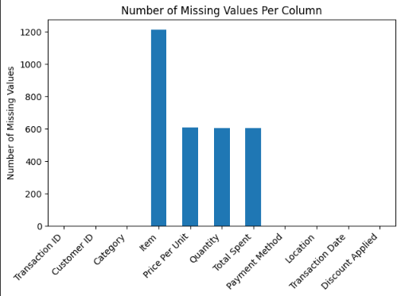
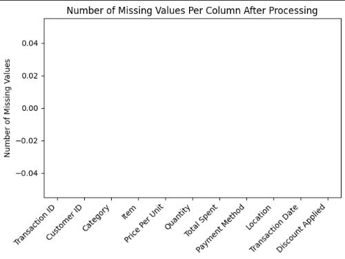

# Introduction

This project cleans the popular dataset 'Retail Store Sales: Dirty for Data Cleaning' from kaggle as a part of Major League Hacking Data Week

 

 

# Methods of Cleaning
The given dataset is cleaned in two methods each having different approaches

# Method 1

- Create a price lookup table for each table to fill in the missing item prices

- Fill in the missing item anme from category with the most popular item from that category to maintain logicality and consistency

- Check if the discount is applied by checking if the sum of the customer's purchase matches their payment. If it does then they didn't get a discount but if it doesn't then they did.

This keeps the data highly accurate and

 

 

# Method 2 filling both numerical and categorical columns with the mean
This method fills in the missing values inside the columns using their mean. This is a class and simplistic approach that comes at the cost of lower data accuracy compared to the previous method.

- Define numerical and categorical columns

- For every column in those column containers fill in the missing values with their mean values

 
 

 
 

# Lets look at the before and after of the dataset

# Before

***

# After
